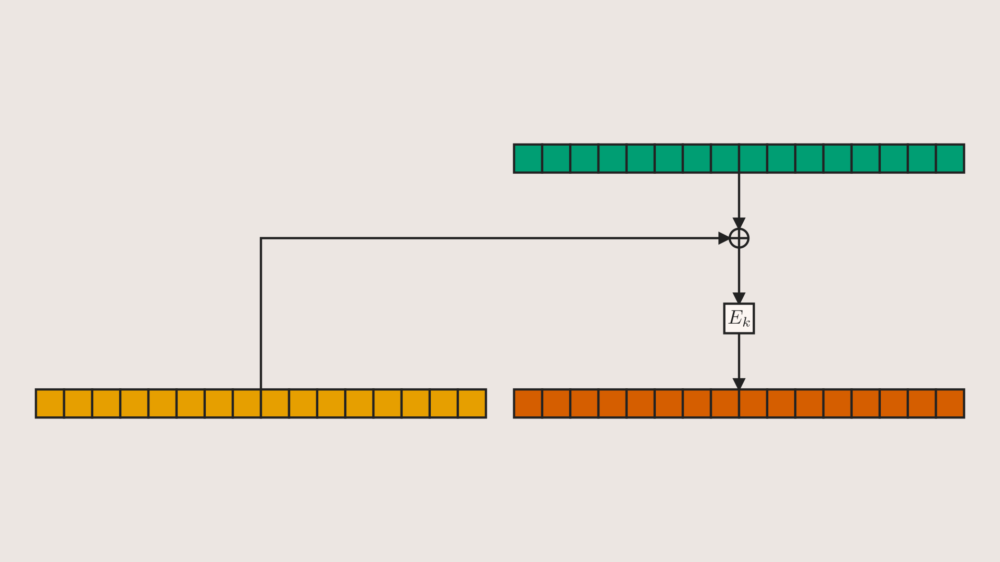
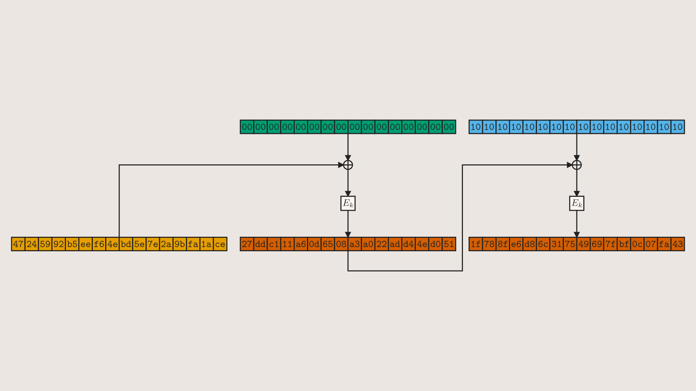
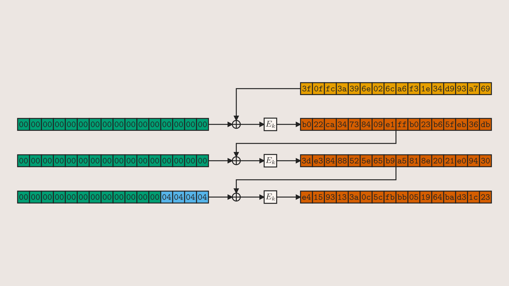
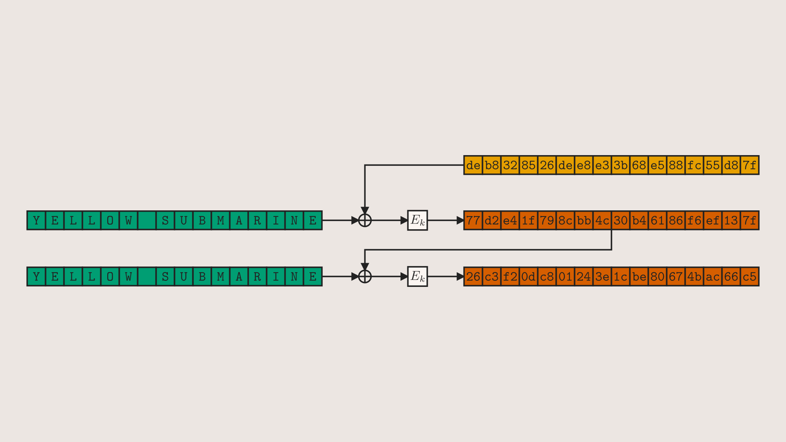

{::nomarkdown}

{:/nomarkdown}

```python
class CBCExample1(Scene):
    def construct(self):
        cbc = CBCBlock(zoom=0.8)
        self.add(cbc)
```

-----

{::nomarkdown}

{:/nomarkdown}

```python
class CBCExample2(Scene):
    def construct(self):
        block_1 = CBCBlock(msg=bytes(16))
        block_2 = CBCBlock(msg=bytes(), prev=block_1)
        cbc_group = ZoomableVGroup(block_1, block_2, zoom=0.55)
        self.add(cbc_group.center())
```

-----

{::nomarkdown}

{:/nomarkdown}

```python
class CBCExample3(Scene):
    def construct(self):
        block_1 = CBCBlock(msg=bytes(16), direction=DOWN)
        block_2 = CBCBlock(msg=bytes(16), prev=block_1, direction=DOWN)
        block_3 = CBCBlock(msg=bytes(12), prev=block_2, direction=DOWN)
        self.add(ZoomableVGroup(block_1, block_2, block_3, zoom=2/3).center())
```

-----

{::nomarkdown}
<video controls allowfullscreen width=100%> <source src="renders/CBCExample4.mp4" type="video/mp4"> </video>
{:/nomarkdown}

```python
class CBCExample4(MovingCameraScene):  # Loops seamlessly
    @staticmethod
    def introduce(cbc):
        # custom creation animation - Create(cbc) and Write(cbc) also work,
        # but i think this looks nicer
        return LaggedStart(
            AnimationGroup(    
                Write(cbc.ct_to_xor),    
                Write(cbc.pt_to_xor),
                Write(cbc.xor_to_enc),
                Write(cbc.enc_to_ct),
                FadeIn(cbc.xor),
                FadeIn(cbc.enc),
            ),
            FadeIn(cbc.ct, shift=0.5*DOWN, run_time=0.5),
            lag_ratio=0.2
        )

    def construct(self):
        iv_block  = CBCBlock()
        chained_1 = CBCBlock(prev=iv_block)
        chained_2 = CBCBlock(prev=chained_1)
        chained_3 = CBCBlock(prev=chained_2)
        chained_4 = CBCBlock(prev=chained_3)
        chained_5 = CBCBlock(prev=chained_4)
        chained_6 = CBCBlock(prev=chained_5)

        self.add(iv_block, chained_1, chained_2, chained_3, chained_4.pt, chained_5.pt, chained_6.pt)
        self.camera.frame.scale(2.2).move_to(chained_2.xor_to_enc)
        self.play(
            self.introduce(chained_4),
            self.camera.frame.animate(rate_func=linear).move_to(chained_3.xor_to_enc),
            run_time=2
        )
```

-----

{::nomarkdown}

{:/nomarkdown}

```python
class CBCExample5(Scene):
    def construct(self):
        # accepts and automatically encodes strings (assumes ASCII)
        blocks = CBCBlocks("YELLOW SUBMARINE"*2, zoom=2/3)
        self.add(blocks)
```

-----

{::nomarkdown}
<video controls allowfullscreen width=100%> <source src="renders/CBCExample6.mp4" type="video/mp4"> </video>
{:/nomarkdown}

```python
class CBCExample6(Scene):
    def construct(self):
        blocks = CBCBlocks("YELLOW SUBMARINE"*3, zoom=2/3)
        self.add(blocks)
        self.wait(0.5)
        self.play(Rewrite(blocks[0], "MISTER BOATSWAIN"))
        self.wait(0.5)
```
