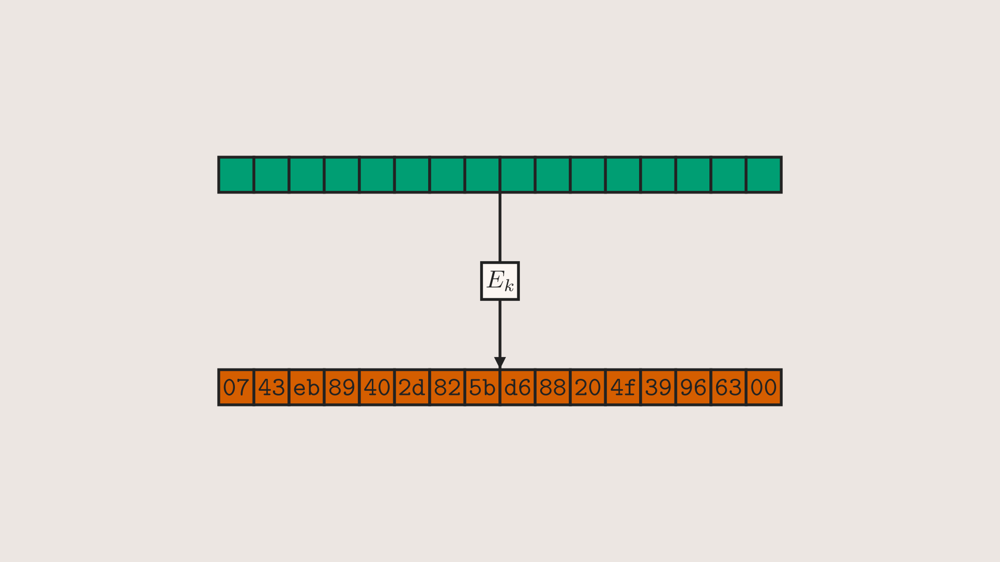
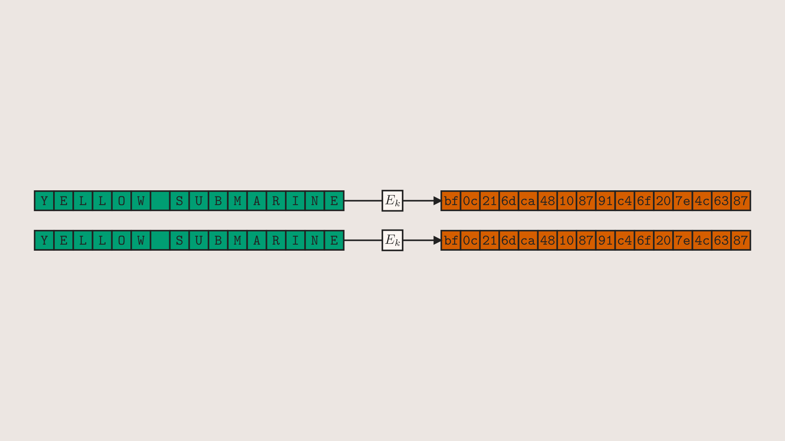

{::nomarkdown}

{:/nomarkdown}

```python
class ECBExample1(Scene):
    def construct(self):
        self.add(ECBBlock())
```

-----

{::nomarkdown}
<video controls allowfullscreen width=100%> <source src="renders/ECBExample3.mp4" type="video/mp4"> </video>
{:/nomarkdown}

```python
class ECBExample3(Scene):
    def construct(self):
        blocks = ECBBlocks(bytes(16*8), direction=RIGHT, pbuff=0.4)
        self.add(blocks.zoom(0.7))
        self.wait()
        new_msg = bytes(15) + b'\x01'
        new_pt_fills, new_ct_fills = [C_PT]*15 + [darken(C_PT, amount=0.25)], darken(C_CT, amount=0.25)
        self.play(*[
            Rewrite(row, new_msg, c_pt=new_pt_fills, c_ct=new_ct_fills)
            for row in blocks[4:]
        ])
        self.wait()
```

-----

{::nomarkdown}

{:/nomarkdown}

```python
class ECBExample4(Scene):
    def construct(self):
        # you can use ASCII strings as inputs and they will be automatically encoded
        blocks = ECBBlocks("YELLOW SUBMARINE"*2, direction=RIGHT)
        self.add(blocks.zoom(0.7))
```
